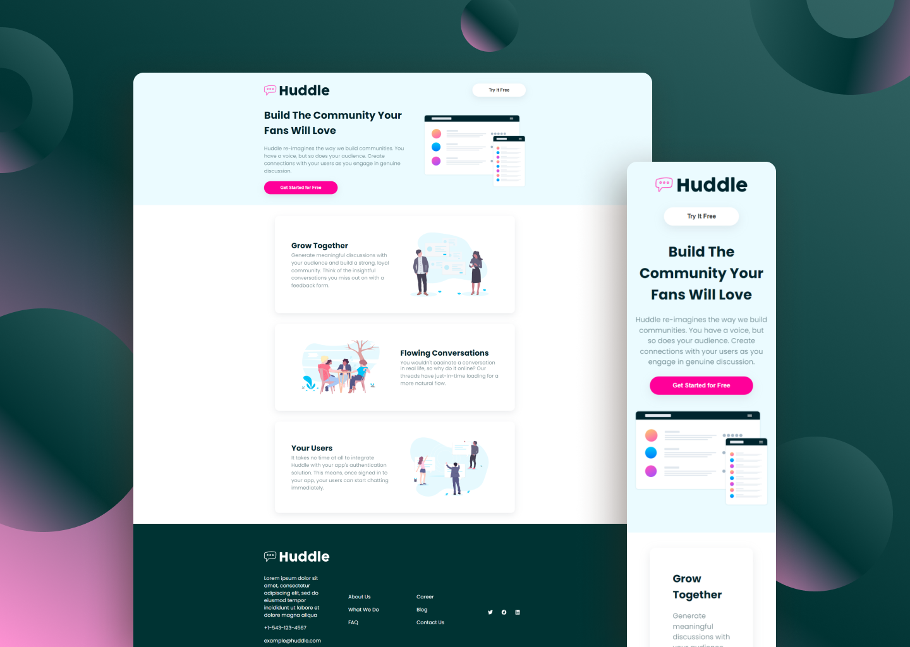

  

    <h1>Huddle</h1>
     
    
A simple landing page to showcase an app who help people to build communities

    <h3><a href="https://huddle-cem.netlify.app/">🔗 Link to the Website</a></h2>
    
  

## Built with

## Context of the Project

- It was to test my basic React knowledge and experiment styled-component,
- The design of the website come from <a href="https://frontendmentor.io/">Front-End Mentor</a>
